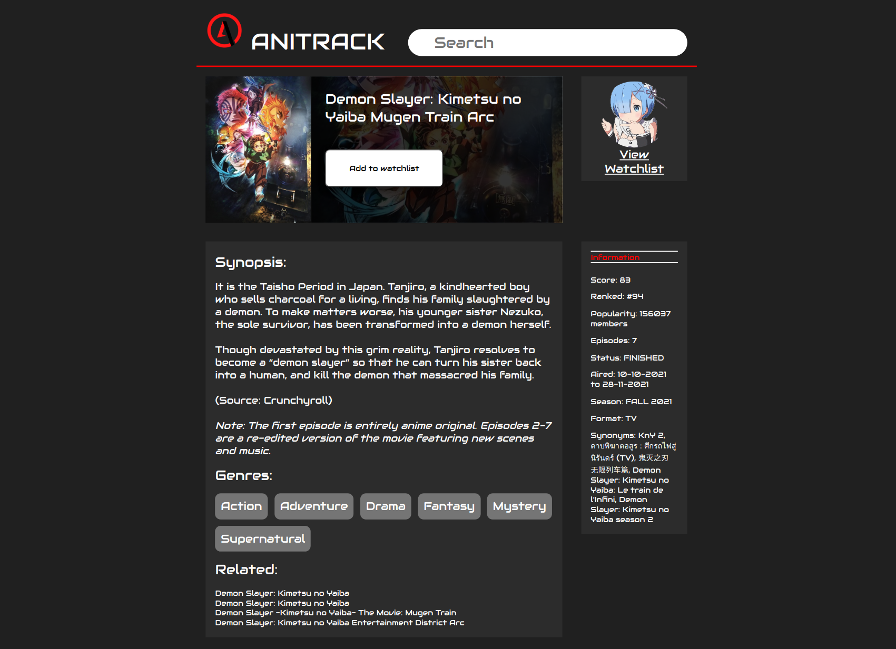
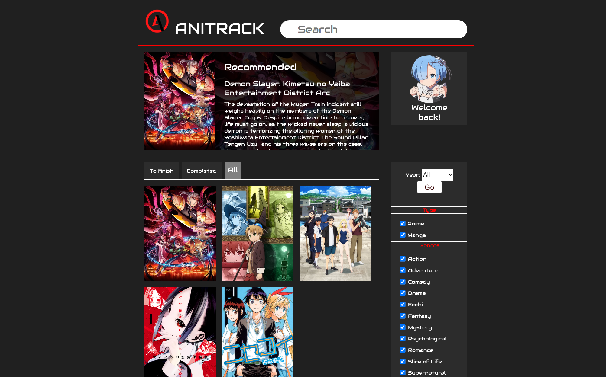

# Project: Anitrack

A fun little anime/manga tracker for desktop. Built with Javascript, HTML, CSS

[Demo it here](http://anitrack-tan.vercel.app/)

## Description
---
A small little project done towards to end of summer to see what I have learned from learning web dev.

Vanilla JS was used to test the extent of what I have learned while attempting [The Odin Project](https://www.theodinproject.com/)

Storage of user watchlist data is done via [Window.localStorage](https://developer.mozilla.org/en-US/docs/Web/API/Window/localStorage)

## Screenshots
---

## Extensions
---
Future extensions of this project would be:
<ul>
    <li>Formatting for a larger range of screens (mobile, tablets,etc.)</li>
    <li>User Login/Logout</li>
    <li>Backend SQL</li>
</ul>

